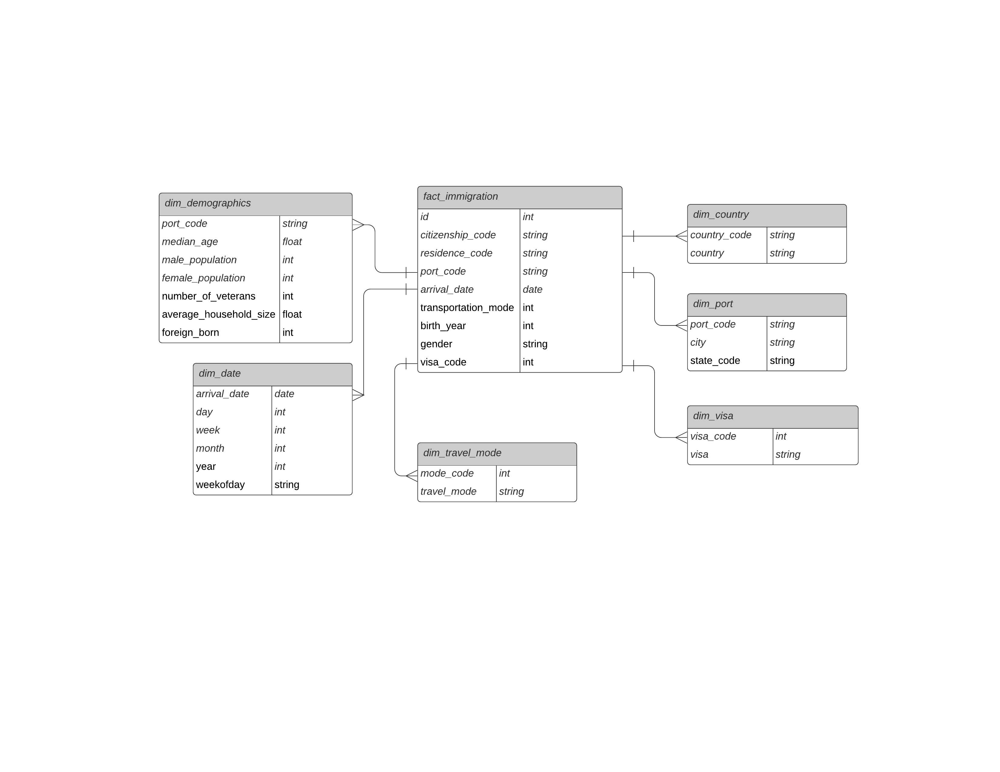

# Summary of the project
The goal of this project is to build an ETL pipeline that extracts I94 immigration data and U.S. City Demographic data. From the tables we build, we can answer questions like what are the most popular ports(cities), what is the gender distribution, etc.

# Database Schema

# Datasets
- country_code.csv (extract from I94_SAS_Labels_Descriptions.SAS)
- port.csv (extract from I94_SAS_Labels_Descriptions.SAS)
- us-cities-demographics.csv
- immigration sas data, path: ../../data/18-83510-I94-Data-2016/

# Data dictionary 

- Fact Table:
    - fact_immigration table:
        - id: Immigration id 
        - citizenship_code: 3-letter code of country of citizenship
        - residence_cod: 3-letter code of country of residence
        - port_code: 3-letter port code
        - arrival_date: date of arrival
        - transportation_mode: transportation mode
        - birth_year: immigrant's year of birth
        - gender: immigrant's gender
        - visa_code: immigrant's visa code

- Dimension Table:
    - dim_visa 
        - visa_code: immigrant's visa code
        - visa: visa type
    - dim_port
        - port_code: 3-letter code of port
        - city: name of the city
        - state_code: 2-letter state code    
    - dim_country
        - country_code: 3-letter code of country
        - country: name of the country 
    - dim_date
        - arrival_date: date of arrival
        - year: year 
        - month: month
        - week: week of year
        - day: day of month
        - dayofweek: day of week
    - dim_demographics
        - port_code:3-letter port code
        - median_age: median age of the city
        - male_population: male population of the city
        - female_population: female population of the city
        - veterans: veterans population of the city
        - foreign_born: foreign-born population of the city
        - average_household_size: average household size       
    - dim_travel_mode
        - mode_code: code of travel mode
        - travel_mode: travel mode
